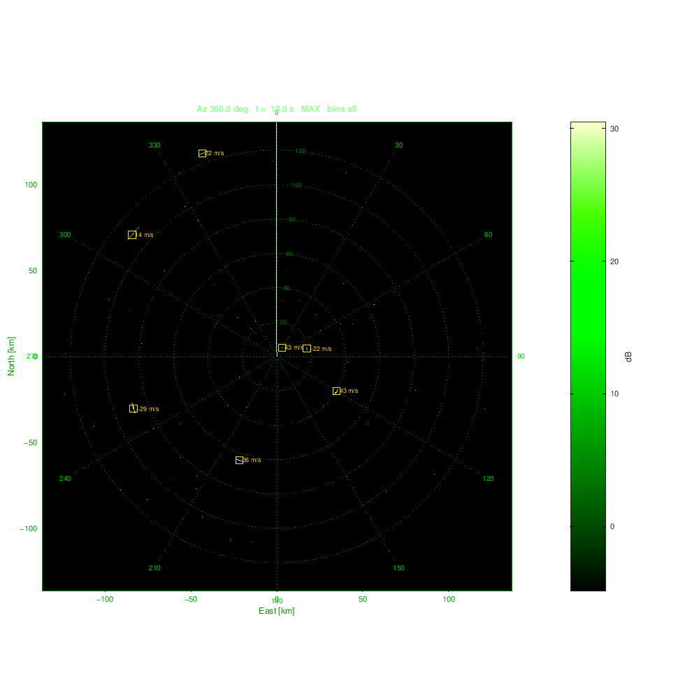
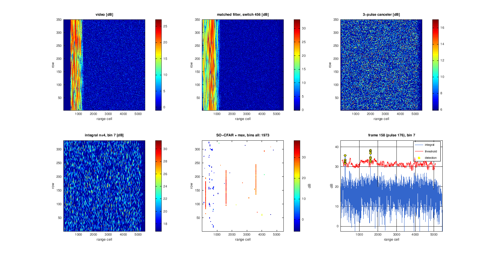

# Radar signal processing chain (MATLAB)

```
video ─► decoder ─► 3-pulse canceler ─► Doppler FFT ─► non-coherent ─► SO-CFAR ─► max over ─► plots / PPI
        (code/LFM,                                      integration               Doppler bins
         matched or your taps)
```

Each block is a separate function, and every value is a parameter. Each block's output is
returned so it can be compared with the matching MCPS log lane (`decoder`, `canceler`,
`integral`, `cfar`). No toolbox is needed. The code runs in MATLAB R2016b+ and GNU Octave 7+.

## Quick start

1. **Put your radar's values in `radar_params.m`:** fs, the codes and decoder taps of the
   two pulses, PRF, rpm and antenna. Every field is documented in `rsp_default_params.m`.
2. **Your data:** run `main_mcps`, then `main_rsp`. This runs the chain and compares every
   block with the log. It then prints the plots (m / deg / m/s) and draws the block and a PPI sector.
3. **Simulated rotating radar:** run `main_scan`. It simulates a full revolution and shows a
   live PPI with a rotating sweep, then prints plots against truth.
4. **Self-test:** run `rsp_selftest` (42 checks).

```matlab
P    = radar_params();
out  = rsp_chain(video, P);              % every block: out.decoder ... out.cfar, out.max
scan = rsp_scan(P, S, 'degrees', 360);   % simulated scan + live PPI
rsp_ppi_replay(scan, 'speed', 1, 'bins', [6 7 8]);   % replay at 6 rpm, chosen bins only
```

Example output (Octave rendering; MATLAB draws the PPI on black):

| PPI after one simulated revolution | Blocks of one 350-pulse block |
|---|---|
|  |  |

## Pulses and decoders

Each pulse is either `type = 'code'` or `type = 'lfm'`. The bandwidth `bwMHz = 1` gives
1 µs chips, or a 1 MHz LFM sweep.

| Field | Meaning |
|---|---|
| `code` | your chip values, any length, binary or polyphase (`rsp_code` has Barker, MLS, Frank, P3, P4) |
| `decoder` | your decoder taps; `[]` = matched filter |
| `decoderForm` | `'fir'`: FIR taps applied by convolution (matched = `conj(fliplr(code))`); `'reference'`: correlation reference (matched = `code`) |
| `decoderRate` | `'chip'` (one tap per chip) or `'sample'` (taps already at fs) |
| `decoderLag` | `[]` aligns on the main peak automatically, so mismatched filters longer than the code also land on the right range cell |
| `fcMHz`, `delayUs` | frequency offset and transmit delay of the pulse |

For every pulse the program prints the PSL, the ISL and the loss against a matched filter.
If the loss is above 3 dB it warns you, because then `decoderForm` or `decoderRate` is
probably wrong.
`rsp_code_mmf(code, len)` designs a least-squares mismatched filter. For Barker 13 with
39 taps it gives −38.5 dB PSL for a 0.2 dB loss.

The short and long outputs are stitched: the short pulse covers the blind zone of the long
pulse. The CFAR runs only on cells whose echo is received in full (`P.cfar.validOnly`).

## Radar, antenna and units

* **Radar:** `P.radar.prfHz = 1000`, `rpm = 6` (36°/s, 0.036° per pulse), `fcMHz = 1300` (λ = 0.23 m).
  With these values a range cell is c/2fs = 25 m at 6 MHz, and the unambiguous velocity is
  ±λ·PRF/4 = ±57.7 m/s.
* **Antenna:** `P.antenna`: 4° 3-dB beam, −25 dB sidelobes, −40 dB back lobe. The pattern is
  one-way; echoes use it two-way.
* **Targets (simulation):** given as `rangeM`, `azDeg`, `velocityMps` (positive = approaching)
  and `snrDb`. The echo is the transmitted signal at a fractional delay 2R(t)/c with carrier
  phase −2π f₀ τ, so Doppler and range walk come from the geometry. Clutter is weak by default
  (CNR 20 dB up to 25 km), with a Gaussian spectrum and spatial texture.
* **Plots (`rsp_extract_plots`):** range [m], azimuth [deg], radial velocity [m/s] (folded) and
  power. Azimuth is corrected for the chain delay: an output row comes from the 21 pulses
  before it.

## Output after the CFAR

`rsp_cfar_max` takes the maximum over the Doppler bins. This is the only max in the chain.
`P.output.bins` selects which bins enter it:

* `[]`: all bins
* `5`: only bin 5
* `2:16`: every bin except zero Doppler

The output is `out.max.value` and `out.max.bin`. `P.cfar.mapValue` sets what the CFAR output
carries:

* `'value'`: the integrated value, like the log lane
* `'snr'`: the value divided by its noise estimate. Bins with different noise floors
  (MTI-shaped) then compare fairly in the max.

## PPI

`rsp_ppi_init` and `rsp_ppi_update` draw the PPI: north up, range rings in km, a rotating
sweep, afterglow (`P.ppi.fadeDb` per revolution), and plot markers labelled with velocity.
`P.ppi.source` selects what is painted:

* `'max'`: the output after CFAR (default)
* `'video'`, `'decoder'` or `'canceler'`: raw views

`rsp_scan` paints the PPI live while it processes. `rsp_ppi_replay` replays a scan at the
real antenna speed or faster, and can be limited to chosen bins.

## Processing blocks (summary)

* **Decoder:** frequency-domain correlation (one FFT of the data, one inverse FFT per pulse),
  with range alignment and normalisation (`'noise'` keeps the same noise floor for both pulses).
* **Canceler:** `x(m) − 2x(m−1) + x(m−2)`. The order or the taps can be changed.
* **Doppler FFT:** `nPulses` pulses per FFT, `nfft` bins, a window, and `hop` pulses between FFTs.
* **Integration:** sum or mean of `n` consecutive FFT outputs per bin, with a square, linear or log law.
* **CFAR:** SO (or CA/GO). The threshold is either `factorDb` or computed from `pfa`. The Pfa
  design uses the exact noise correlation of the chain (`rsp_cfar_looks`). Measured on
  simulated noise: 1–2e-6 for a design of 1e-6.

## Comparing with your log (`main_rsp`)

* **a)** The full chain from video is compared with every log lane.
* **b)** Each block is fed the **previous log lane**, so a mismatch points at exactly one block.

`rsp_compare` finds the pulse and range shift, then the gain, correlation and NMSE. For CFAR
lanes it reports matched, missed and extra detections.

## Files

| File | Purpose |
|---|---|
| `radar_params.m` | **your radar's values** |
| `rsp_default_params.m` | every parameter with documentation |
| `main_rsp.m`, `main_scan.m` | log data and comparison / simulated rotating radar with PPI |
| `rsp_chain.m` | the whole chain for one block |
| `rsp_waveform.m`, `rsp_decoder.m`, `rsp_code.m`, `rsp_code_mmf.m`, `rsp_window.m` | pulses, codes, decoders |
| `rsp_matched_filter.m` | pulse compression, alignment, stitching |
| `rsp_canceler.m`, `rsp_canceler_taps.m` | MTI canceler |
| `rsp_doppler_fft.m`, `rsp_nci.m` | Doppler FFT, non-coherent integration |
| `rsp_cfar.m`, `rsp_cfar_cells.m`, `rsp_cfar_factor.m`, `rsp_cfar_looks.m` | CFAR and its design |
| `rsp_cfar_max.m` | max over the selected bins after the CFAR |
| `rsp_extract_plots.m` | plot extraction |
| `rsp_simulate.m`, `rsp_truth.m`, `rsp_antenna_pattern.m`, `rsp_geometry.m` | simulation and units |
| `rsp_scan.m` | block-by-block scan processing (output independent of block size) |
| `rsp_ppi_init.m`, `rsp_ppi_update.m`, `rsp_ppi_replay.m` | PPI display |
| `rsp_plot.m`, `rsp_compare.m`, `rsp_db_limits.m` | figures and comparison |
| `rsp_selftest.m` | tests |

## Notes

* **Frequency diversity:** in the simulation the short and long pulses sit at −1.5 / +1.5 MHz.
  If they share one frequency, the unblanked tail of the long echo leaks into the short
  decoder and makes ghosts in the blind zone. If your radar uses a single frequency, set
  `fcMHz = 0` for both.
* **Velocity folding:** at PRF 1 kHz and L band, velocity is ambiguous every 115 m/s. Plots
  report the folded value; `rsp_truth` gives the folded truth for comparison.
* **Zero-Doppler clutter residue:** it can still pass the CFAR (the Pfa design assumes thermal
  noise). Use `P.output.bins = 2:16` to leave bin 1 out of the output.
